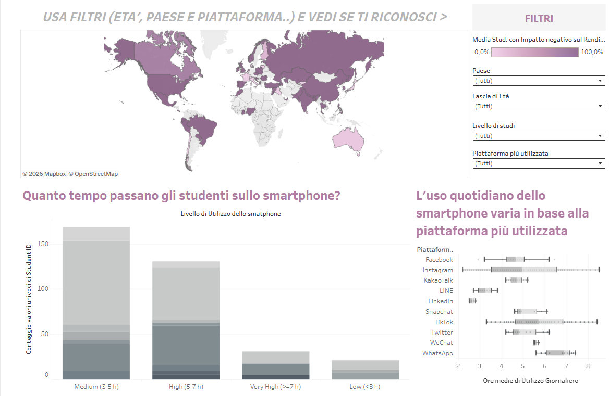
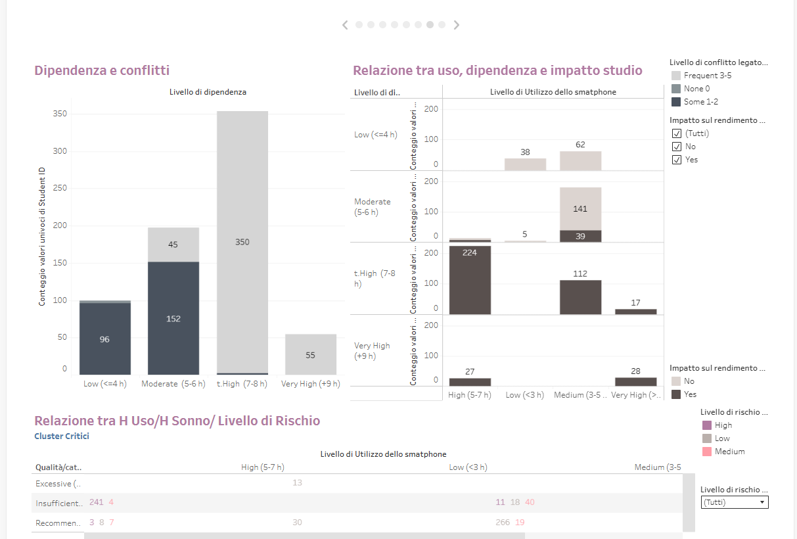

# 📊 Chi ti ruba il sonno?

## Data Analysis Project – Tableau & Web Deployment

Questo progetto nasce con l’obiettivo di analizzare l’impatto delle abitudini digitali sulla qualità del sonno, attraverso un approccio data-driven orientato all’identificazione di pattern comportamentali e insight misurabili.

## 🔎 Obiettivo

Analizzare la relazione tra tempo di utilizzo dei dispositivi digitali e durata del sonno, individuando pattern significativi per fasce d’età.

## 📈 Dashboard sviluppata in Tableau Public

La dashboard include:

- KPI chiave (Avg Usage Hours, Avg Sleep Hours)
- Analisi delle correlazioni tra screen time e riduzione del sonno
- Segmentazione per fasce d’età
- Visual storytelling orientato all’interpretazione decisionale

## 🛠 Approccio metodologico

- Data cleaning e validazione dataset
- Creazione di metriche calcolate e indicatori sintetici
- Analisi esplorativa (EDA)
- Costruzione di dashboard interattiva con filtri dinamici
- Ottimizzazione UX per fruizione web
- Deploy tramite GitHub Pages

## 🚀 Competenze sviluppate

- Data visualization & KPI design
- Interpretazione di correlazioni e trend
- Traduzione dei dati in insight leggibili
- Comunicazione efficace dei risultati
- 
## 📊 Dashboard Preview

## 🔗 Dashboard Live

👉 [Visualizza la dashboard online](https://sofiabiancarosa-max.github.io/chi-ti-ruba-il-sonno/)
